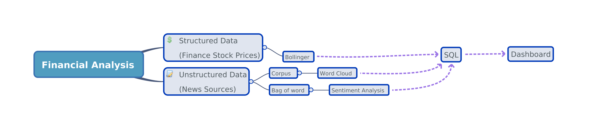

# NLP
The financial dashboard is created to support the financial stock decision base on the real time unstructured data of the relevant news article and structured stock data.  

## Components
### Bolliger bands

### Word cloud

### Sentiment analysis

## Wireframe

## High architechture diagram

